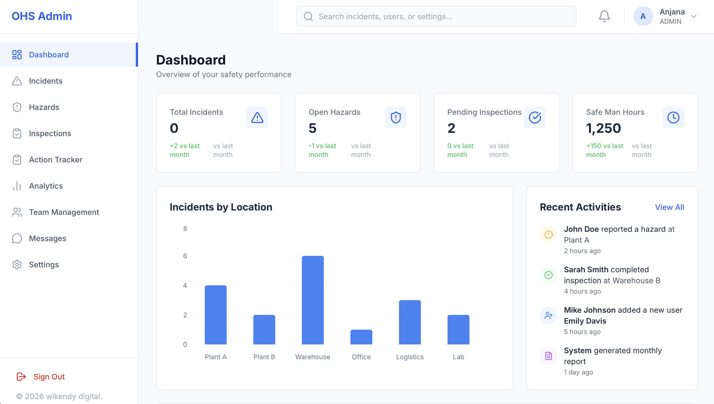
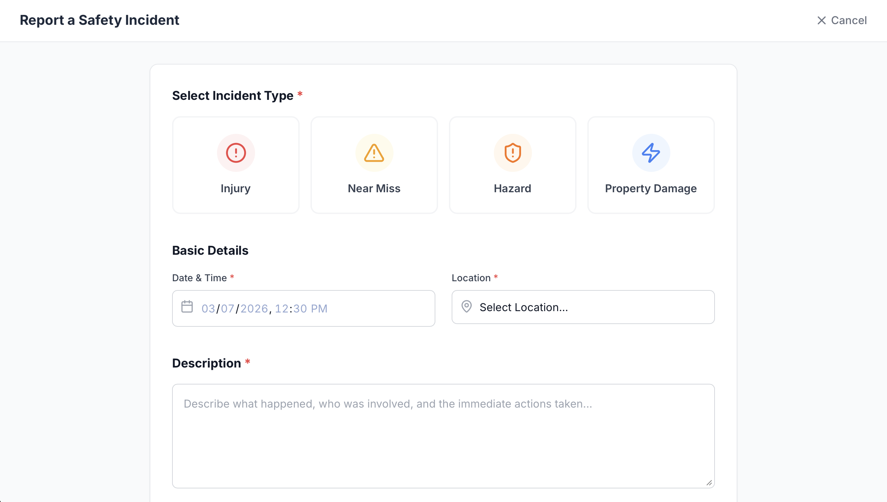
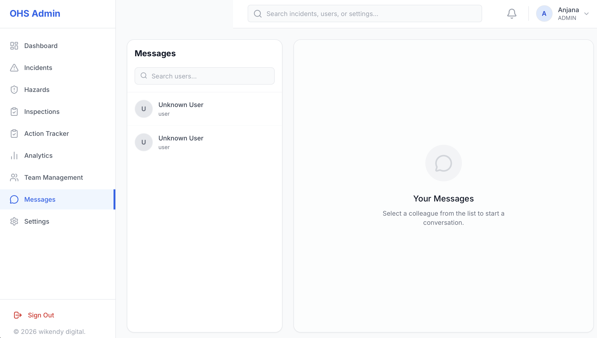
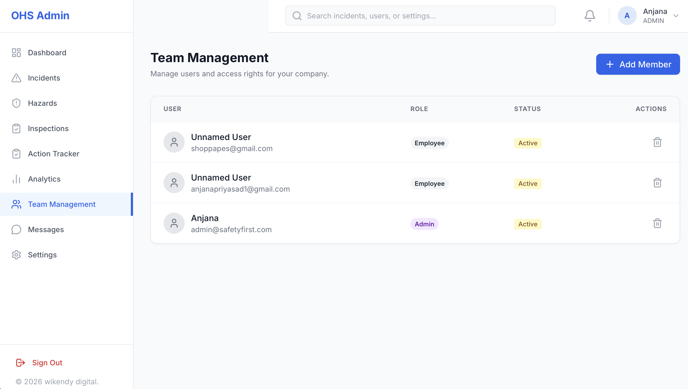
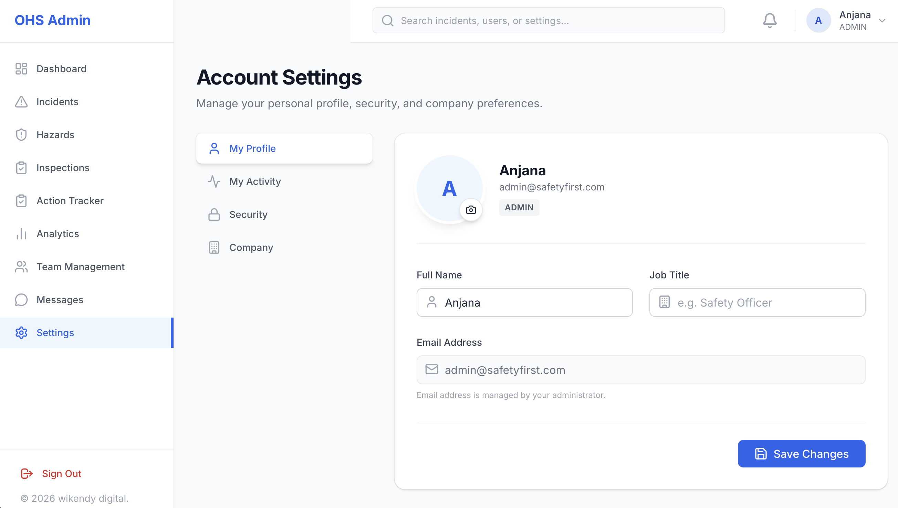

# 🛡️ Occupational Health and Safety (OHS) Admin Dashboard

A comprehensive, modern web application built for managing Occupational Health and Safety operations in workplaces, factories, and construction sites. Built with React, Tailwind CSS, and Supabase.



## ✨ Key Features

* **📊 Analytics Dashboard:** Overview of all safety metrics, open incidents, and pending actions.
* **🚨 Incident & Hazard Reporting:** Easily log and track workplace incidents and potential hazards.
* **📋 Safety Inspections:** Conduct and manage routine safety audits and inspections.
* **💬 Real-Time Direct Messaging:** Internal chat system for employees and safety managers to communicate instantly, including file/image sharing.
* **👥 Team Management:** Manage users, roles (Admin/Employee), and access rights seamlessly.
* **⚙️ Comprehensive Settings:** User profile management with avatar uploads, activity logs, and system preferences.

## 📸 Screenshots

| Incidents Tracker | Real-time Chat |
| :---: | :---: |
|  |  |

| Team Management | User Profile |
| :---: | :---: |
|  |  |

## 🛠️ Tech Stack

* **Frontend:** React (Vite), Tailwind CSS, Lucide React Icons
* **Backend & Database:** Supabase (PostgreSQL)
* **Storage:** Supabase Storage (for avatars and message attachments)
* **Real-time:** Supabase Realtime Subscriptions

## 🚀 Getting Started (Local Development)

To get a local copy up and running, follow these simple steps.

### Prerequisites
* Node.js installed on your machine.
* A free account on [Supabase](https://supabase.com/).

### Installation

1.  **Clone the repository**
    ```sh
    git clone [https://github.com/anjana-priyasad/safety-management-system.git](https://github.com/anjana-priyasad/safety-management-system.git)
    ```
2.  **Install NPM packages**
    ```sh
    cd safety-management-system
    npm install
    ```
3.  **Setup the Database**
    * Create a new project in Supabase.
    * Go to the SQL Editor and copy-paste the entire content of the `database-schema.sql` file included in this repository. Run the script to create all necessary tables and storage buckets.
4.  **Configure Environment Variables**
    * Create a `.env` file in the root directory.
    * Add your Supabase URL and Anon Key:
        ```env
        VITE_SUPABASE_URL=your_supabase_url_here
        VITE_SUPABASE_ANON_KEY=your_supabase_anon_key_here
        ```
5.  **Run the App**
    ```sh
    npm run dev
    ```

---

## 💼 Custom Development & Deployment Support

Looking for a customized version of this OHS Management System tailored specifically to your company's workflows? Or need professional assistance deploying this to a production environment?

**Wikendy Digital** specializes in developing robust web solutions. We can help you with:
* Custom feature development (e.g., PDF reports, Mobile app versions, IoT integrations).
* Role-based access control enhancements.
* Secure cloud deployment and database management.
* White-labeling the application with your company branding.


📫 **Get in touch:**
* **Website:** [wikendy.com](https://wikendy.com)
* **Contact:** Drop a message via GitHub or through our website!
* **Developer Contact:** [LinkedIn](https://www.linkedin.com/in/anjanapriyasad)
* **Freelance:** [Upwork](https://www.upwork.com/freelancers/priyasad)
* **Email:** anjanapriyasad@yahoo.com

## 📄 License

Distributed under the MIT License. See `LICENSE` for more information.